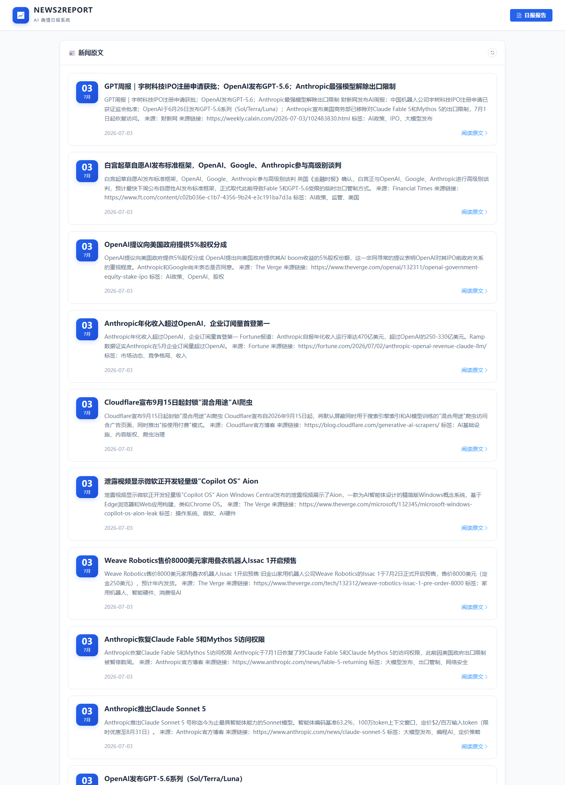
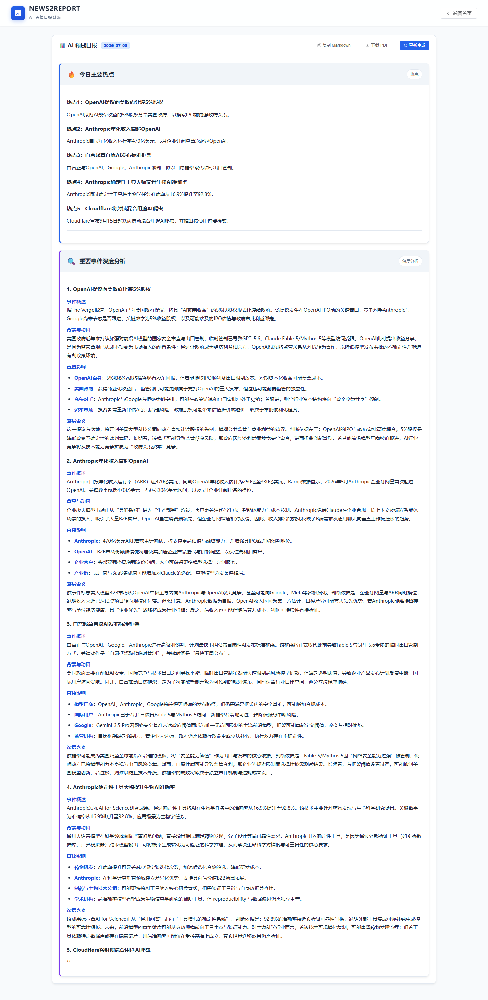
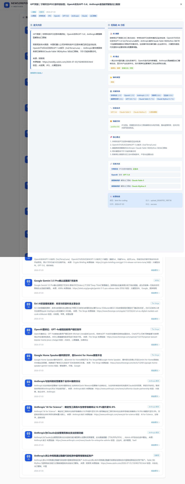

# AI舆情分析日报系统

一个自动采集 AI 领域新闻、结构化处理、智能分析并生成日报的可视化系统。

---

## 1. 数据源说明

### 1.1 数据来源

系统目前支持以下数据输入渠道：

| 数据类型 | 具体来源 / 入口 | 说明 |
|---|---|---|
| 英文科技媒体 | The Verge、TechCrunch、Crypto Briefing | 覆盖 OpenAI、Anthropic、Google 等海外前沿动态 |
| 中文权威媒体 | 财新网、亿邦动力、至顶网等 | 中文行业深度报道，覆盖国内 AI 企业动态 |
| 聚合/分析平台 | AI Tools Recap、The Decoded Media | 提供多源汇总和深度分析视角 |
| 官方渠道 | Anthropic Release Notes、OpenAI Blog | 一手产品发布信息，准确性最高 |
| 社交媒体/社区 | X 平台、Reddit 讨论 | 反映舆论热点和行业人士观点 |
| 用户上传 | 前端 `/api/upload-news` | 支持手动输入新闻文本 |
| PDF 上传 | 前端 `/api/upload-pdf` | 支持上传 PDF 并抽取正文 |
| URL 抓取 | 前端 `/api/fetch-url` | 支持抓取任意网页正文 |

数据以 **JSONL** 格式追加写入 `backend/data/raw_news.jsonl`，作为原始数据层入口。

### 1.2 选择理由

- **权威性**：优先选择主流科技媒体和官方博客，降低信源噪声。
- **覆盖面**：通过英/中/聚合/社交多源互补，兼顾国际前沿与国内视角。
- **时效性**：官方渠道保证一手信息；RSS、网页抓取和用户上传提供即时补充。
- **可扩展性**：预留手动上传、PDF、URL 三种入口，支持非结构化来源快速接入。

### 1.3 数据特点

- **半结构化输入**：原始新闻包含标题、正文、来源、发布时间、URL 等字段，但内容长度、语言、格式差异较大。
- **多语言混合**：同时处理中文、英文及中英混合内容。
- **主题聚焦**：围绕大模型、AI 芯片、自动驾驶、机器人、AIGC、AI 政策、AI 应用、AI 融资、AI 安全、学术前沿等方向。
- **来源多样**：来源类型包括科技媒体、官方博客、社交媒体、学术平台、聚合平台等。
- **质量不均**：存在标题党、重复转载、日期格式混乱、正文含广告/导航噪音等问题，需要清洗与校验。

---

## 2. 系统设计思路

### 2.1 整体架构

系统采用 **前后端分离 + 文件型数据持久化** 架构：

```
┌─────────────────────────────────────────────────────────────────────────┐
│                              用户浏览器                                    │
│                         http://localhost:5173                            │
└───────────────────────────────────┬─────────────────────────────────────┘
                                    │
                                    ▼
┌─────────────────────────────────────────────────────────────────────────┐
│                              前端 (Frontend)                              │
│  Vue 3 + Vite + TypeScript + Element Plus + ECharts / marked             │
│  职责：日报展示、新闻列表、上传分析、可视化图表、Markdown 渲染            │
└───────────────────────────────────┬─────────────────────────────────────┘
                                    │ /api/*  (开发环境 Vite Proxy)
                                    ▼
┌─────────────────────────────────────────────────────────────────────────┐
│                              后端 (Backend)                               │
│                    FastAPI + Uvicorn  (Python 3.11+)                     │
│  ┌─────────────────────────────────────────────────────────────────┐    │
│  │                         REST API 层                              │    │
│  │  /api/health  /api/daily-report  /api/news  /api/upload-news     │    │
│  └──────────────────────────────────┬──────────────────────────────┘    │
│                                     │                                     │
│  ┌──────────────────────────────────┼────────────────────────────────┐  │
│  │                              业务服务层                              │  │
│  │  数据采集 → 结构化抽取 → 热点聚合分析 → 日报/PDF 生成 → 报告下载   │  │
│  └──────────────────────────────────┼────────────────────────────────┘  │
│                                     │                                     │
│  ┌──────────────────────────────────┴────────────────────────────────┐  │
│  │                              数据持久化层                            │  │
│  │   SQLite (上传记录)  +  JSON/JSONL 文件 (新闻、结构化数据、报告)    │  │
│  └────────────────────────────────────────────────────────────────────┘  │
└─────────────────────────────────────────────────────────────────────────┘
                                    │
                                    ▼
┌─────────────────────────────────────────────────────────────────────────┐
│                           外部依赖 / 第三方服务                           │
│   OpenAI 兼容 API (Kimi/OpenAI)    RSS / 搜索 / 网页抓取 / PDF 解析      │
└─────────────────────────────────────────────────────────────────────────┘
```

### 2.2 数据分层

后端内部按四阶段处理数据：

```
┌─────────────┬─────────────┬─────────────┬─────────────────────┐
│  阶段1: 数据层 │  阶段2: 结构化层 │  阶段3: 分析层  │   阶段4: 输出层      │
├─────────────┼─────────────┼─────────────┼─────────────────────┤
│ 获取AI新闻数据  │ Schema设计    │ 热点聚合排序   │ 日报Markdown生成    │
│ (10~20条)    │ 逐条结构化抽取  │ 事件深度分析   │ 可视化图表生成       │
│ 数据清洗去重   │ 数据校验      │ 趋势判断      │ HTML页面渲染       │
│ 存入JSON     │ 存入JSON      │ 风险/机会识别  │ PDF下载           │
└─────────────┴─────────────┴─────────────┴─────────────────────┘
```

### 2.3 关键设计决策

| 决策 | 方案 | 理由 |
|---|---|---|
| 数据持久化 | SQLite + JSON/JSONL 文件 | 降低部署成本，方便调试与版本追溯；JSONL 适合追加写入 |
| 接口协议 | RESTful API / FastAPI | 类型安全、自动生成文档、异步支持好 |
| AI 模型接入 | OpenAI 兼容接口 | 可切换 Kimi / OpenAI / 其他兼容服务，配置即插即用 |
| 输出格式 | Markdown + HTML + PDF | Markdown 便于人工编辑；HTML 便于前端展示；PDF 便于分发归档 |
| 定时任务 | APScheduler | 每日固定时间自动生成日报，减少人工干预 |
| 前端渲染 | Element Plus + ECharts + marked | 快速搭建管理后台风格界面，支持图表与 Markdown |
| 错误处理 | 分层捕获 + 降级 + 日志记录 | 单条新闻失败不影响整体流程，保证系统可用性 |

---

## 3. AI 使用方式

### 3.1 使用场景

AI 大模型在本系统中承担两类核心任务：

| 场景 | 输入 | 输出 | 位置 |
|---|---|---|---|
| **单条新闻结构化抽取** | 清洗后的新闻标题、正文、来源、时间、URL | 符合 schema 的结构化字段（摘要、观点、实体、情感、关系等） | `src/services/news_extractor.py`、`src/data/step2_extract_structure.py` |
| **日报生成** | 当日结构化新闻列表（标题、摘要、分类、标签、实体、要点等） | 完整的《AI领域日报》Markdown 报告 | `src/services/daily_report_generator.py` |

### 3.2 Prompt 设计

#### 3.2.1 结构化抽取 Prompt

- **角色设定**：系统提示词将模型定位为“专业的 AI 产业分析师”。
- **Schema 约束**：在 prompt 中显式列出 JSON Schema，要求模型严格按字段输出，禁止添加额外字段。
- **枚举约束**：category、source.type、event_type、significance、impact_direction、sentiment.overall 等字段均给出可选值列表。
- **字段细则**：
  - `ai_summary` 要求“主体 + 动作 + 关键数据 + 影响”结构，80-150 字。
  - `key_points` 最多 5 条，每条一句且包含事实或数据。
  - `entities` 至少 2 个，`relations` 至少 1 条实体三元组。
  - `publish_time` 统一为 ISO 8601 格式。
- **输出格式**：明确要求输出合法 JSON，禁止 Markdown 代码块。

#### 3.2.2 日报生成 Prompt

- **角色设定**：模型定位为“资深的 AI 产业分析师”。
- **报告模板**：在 prompt 中给出完整的 Markdown 模板，包含：
  - 日报导读
  - 今日主要热点（3-5 个）
  - 重要事件深度分析（背景与动因、直接影响、深层含义）
  - 趋势判断（技术/应用/政策/资本）
  - 风险与机会提示（确定性评级 + 时间窗口）
- **写作约束**：
  - 禁止空洞表述、整段加粗、emoji。
  - 每个论点必须有因果逻辑链。
  - 无数据支撑的观点标注 `[待验证]`。
  - 趋势判断每个方向至少引用 2 个具体事件/数据。
  - 禁止输出思考过程，必须从 `# AI领域日报 —— [日期]` 开始。

### 3.3 错误处理

系统围绕 AI 调用设计了多层容错机制：

#### 3.3.1 单条结构化抽取错误处理

- **重试机制**：JSON 解析失败、Schema 校验失败、空内容时自动重试，最多 3 次，间隔指数退避（1s、2s、4s）。
- **失败降级**：超过最大重试次数后，生成一条“失败占位”记录，填充默认值并记录 `error_msg`，避免整条流水线中断。
- **异常分类**：区分 `JSONDecodeError`、`ValidationError`、`ValueError` 与 OpenAI API 异常，分别记录日志。

#### 3.3.2 日报生成错误处理

- **前置校验**：未配置 `OPENAI_API_KEY` 时直接抛出 `RuntimeError`。
- **API 异常分类处理**：
  - `AuthenticationError`：提示 API Key 无效。
  - `BadRequestError`：提示上下文超长。
  - `RateLimitError`：提示调用过于频繁。
  - `APIError`：兜底提示。
- **内容后处理**：
  - 若模型返回 `reasoning_content`（推理模型），自动回退使用。
  - 通过正则 `_strip_thinking_prefix` 去除思考前缀，确保只保留正式日报正文。
  - 正文为空时抛出异常，避免生成空报告。

#### 3.3.3 服务层错误处理

- FastAPI 接口统一捕获异常并返回结构化错误响应。
- 定时任务失败仅记录日志，不影响服务运行。
- 单条上传/URL/PDF 分析失败时返回 400/500 并附带具体错误信息。

---

## 4. 核心流程说明

### 4.1 从原始数据到最终报告的完整流程

```
┌──────────────┐     ┌──────────────┐     ┌──────────────┐     ┌──────────────┐
│  1. 数据采集  │ --> │  2. 数据清洗  │ --> │ 3. AI结构化  │ --> │  4. 报告生成  │
└──────────────┘     └──────────────┘     └──────────────┘     └──────────────┘
       │                    │                    │                    │
       ▼                    ▼                    ▼                    ▼
  raw_news.jsonl      cleaned_news.json   structured_news.json  daily_report_{date}.md
                                                          daily_report_{date}.html
                                                          daily_report_{date}.pdf
```

### 4.2 阶段一：数据采集

- 通过 RSS、网页抓取、搜索接口或用户上传（手动输入 / PDF / URL）收集 AI 领域新闻。
- 原始数据以 JSONL 格式追加写入 `backend/data/raw_news.jsonl`。
- 每条原始记录至少包含：`title`、`content`、`source`、`published_at`、`url`。

### 4.3 阶段二：数据清洗

由 `src/data/step1_fetch_data.py` 执行：

1. **读取原始数据**：逐行读取 `raw_news.jsonl`，跳过空行，捕获 JSON 解析错误。
2. **字段校验**：检查必要字段是否存在且非空。
3. **日期标准化**：将多种日期格式统一为 `YYYY-MM-DD`。
4. **去重**：基于 `标题 + URL` 去重，保留第一条。
5. **排序**：按发布时间从新到旧排序。
6. **输出**：生成 `backend/data/cleaned_news.json`。

### 4.4 阶段三：AI 结构化抽取

由 `src/services/news_extractor.py` 和 `src/data/step2_extract_structure.py` 执行：

1. 读取 `cleaned_news.json`。
2. 对每条新闻调用大模型 API，使用结构化抽取 Prompt 生成 JSON。
3. 使用 Pydantic Schema（`src/schema/news_schema.py`）校验模型输出。
4. 注入系统字段：`id`、`title`、`publish_time`、`original_text`、`source.url`。
5. 记录处理元数据：`extracted_at`、`model`、`batch_id`、`status`、`retry_count`、`error_msg`。
6. 输出到 `backend/data/structured_news.jsonl` 和 `structured_news.json`。

### 4.5 阶段四：日报生成与输出

由 `src/services/daily_report_generator.py` 执行：

1. 读取 `structured_news.json`，按目标日期筛选新闻。
2. 将内部结构化数据转换为日报生成所需格式（含标题、摘要、来源、分类、标签、实体、影响等级、核心要点）。
3. 调用大模型 API，使用日报生成 Prompt 生成 Markdown。
4. 对模型输出进行后处理：去除思考前缀、校验非空。
5. 使用 `markdown2` 转换为 HTML。
6. 使用 ReportLab 生成 PDF（支持 CJK 中文字体）。
7. 输出文件存放于 `backend/data/output/`：
   - `daily_report_{date}.md`
   - `daily_report_{date}.html`
   - `daily_report_{date}.pdf`

### 4.6 定时与触发方式

| 触发方式 | 说明 |
|---|---|
| 定时任务 | 后端启动时由 APScheduler 注册，默认每天 09:00 自动生成当日日报 |
| 手动触发 | 前端或 API 调用 `/api/daily-report/generate` |
| 强制刷新 | 调用 `/api/daily-report?force=true` 可跳过缓存重新生成 |
| 文件访问 | `/api/daily-report/pdf` 可在 PDF 不存在时先触发生成再返回 |

---

## 5. 快速开始

### 5.1 目录结构

```
news2report/
├── backend/                 # 后端系统
│   ├── .venv/              # Python 虚拟环境
│   ├── data/               # 数据目录
│   │   ├── raw/           # 原始采集数据
│   │   ├── processed/     # 结构化后数据
│   │   └── output/        # 日报/图表输出
│   ├── src/               # 源码
│   │   ├── data/          # 数据采集与清洗
│   │   ├── schema/        # Schema 设计与校验
│   │   ├── analysis/      # 热点聚合与事件分析
│   │   ├── output/        # Markdown/图表/HTML 生成
│   │   └── utils/         # 工具函数
│   ├── requirements.txt   # Python 依赖
│   └── .env.example       # 后端环境变量示例
│
├── frontend/               # 前端展示页面
│   ├── src/               # 源码
│   │   ├── components/    # 组件
│   │   ├── views/         # 页面
│   │   ├── utils/         # 工具函数
│   │   └── assets/        # 静态资源
│   ├── package.json       # Node 依赖配置
│   ├── vite.config.ts     # Vite 配置
│   └── .env.example       # 前端环境变量示例
│
└── README.md
```

### 5.2 环境搭建

#### 后端

```bash
cd backend
python -m venv .venv
.venv/Scripts/python.exe -m pip install -r requirements.txt
cp .env.example .env
# 编辑 .env 填入 API Key
```

#### 前端

```bash
cd frontend
npm install
npm run dev
```

### 5.3 访问地址

| 服务 | 地址 | 说明 |
|---|---|---|
| 前端开发服务器 | http://localhost:5173 | Vite 热更新 |
| 后端 API 服务 | http://localhost:8000 | FastAPI |
| 后端健康检查 | http://localhost:8000/api/health | 服务状态 |

### 5.4 配置说明

复制 `.env.example` 为 `.env` 后，填入 OpenAI 兼容 API Key 等必要配置。

| 变量 | 说明 |
|---|---|
| `OPENAI_API_KEY` | API Key |
| `OPENAI_BASE_URL` | API Base URL，例如 `https://api.kimi.com/coding/v1` |
| `OPENAI_MODEL` | 模型名称，例如 `kimi-k2.5` |
| `DAILY_REPORT_HOUR` | 日报自动生成小时（默认 9） |
| `DAILY_REPORT_MINUTE` | 日报自动生成分钟（默认 0） |

---

## 6. 技术栈

- **后端**: Python 3.11 + FastAPI + Uvicorn + Pydantic + APScheduler + SQLite
- **前端**: Vue 3 + Vite + TypeScript + Element Plus + ECharts + marked
- **AI**: OpenAI 兼容 API（支持 Kimi / OpenAI 等）
- **文档输出**: Markdown + HTML + PDF（ReportLab）

---

## 7. API 接口与报告下载

### 7.1 核心 API 接口

| 接口 | 方法 | 说明 |
|---|---|---|
| `/api/health` | GET | 后端健康检查 |
| `/api/news` | GET | 获取清洗后的原始新闻列表 |
| `/api/structured-news` | GET | 获取 AI 结构化后的新闻列表 |
| `/api/daily-report` | GET | 获取或生成 AI 领域日报 |
| `/api/daily-report/generate` | POST | 强制重新生成日报 |
| `/api/daily-report/pdf` | GET | 下载指定日期日报 PDF |
| `/api/upload-news` | POST | 手动上传新闻文本并分析 |
| `/api/upload-pdf` | POST | 上传 PDF 文件并分析 |
| `/api/fetch-url` | POST | 抓取网页链接内容并分析 |

### 7.2 日报下载链接

- **在线查看日报**：`http://localhost:5173/daily-report`
- **下载日报 PDF**：`http://localhost:8000/api/daily-report/pdf?date=YYYY-MM-DD`
- **强制重新生成并下载**：先调用 `POST /api/daily-report/generate`，再访问 PDF 链接

### 7.3 分析日报下载链接

针对单条上传/抓取的文章，系统会生成两份 PDF 报告，可通过记录 ID 下载：

| 接口 | 说明 |
|---|---|
| `GET /api/reports/{record_id}/analysis` | 下载该文章的 **AI 分析报告 PDF** |
| `GET /api/reports/{record_id}/structured` | 下载该文章的 **结构化分析报告 PDF** |
| `GET /api/reports/{record_id}/original` | 下载该文章的 **原始文本 TXT** |

其中 `{record_id}` 对应新闻结构化数据中的 `id` 字段，例如 `news_20260703_001`。

### 7.4 前端页面预览

系统首页展示近期 AI 新闻列表，点击新闻卡片可查看 AI 结构化分析详情；点击右上角「日报报告」可进入日报页面。

**首页新闻列表：**



**日报页面：**



**新闻详情页（点击卡片后从右侧滑出）：**


